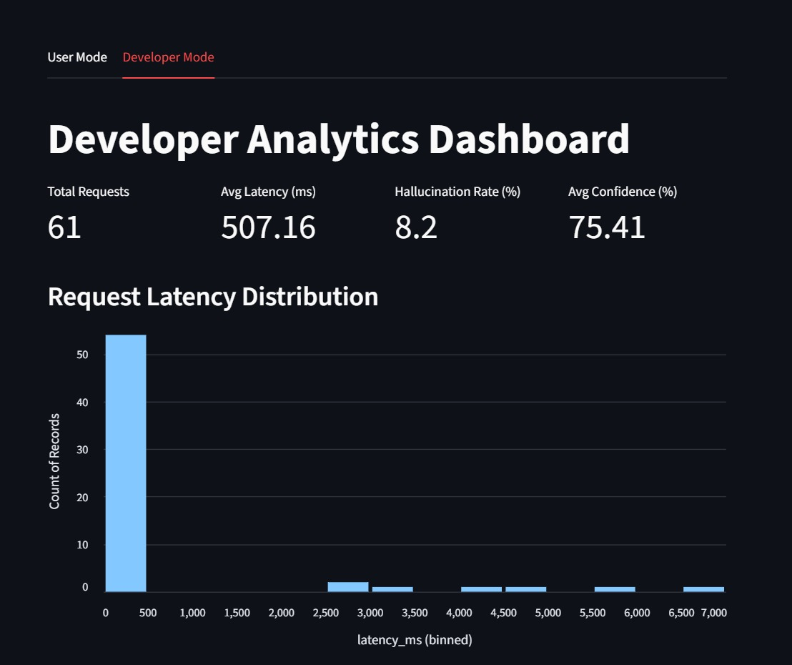
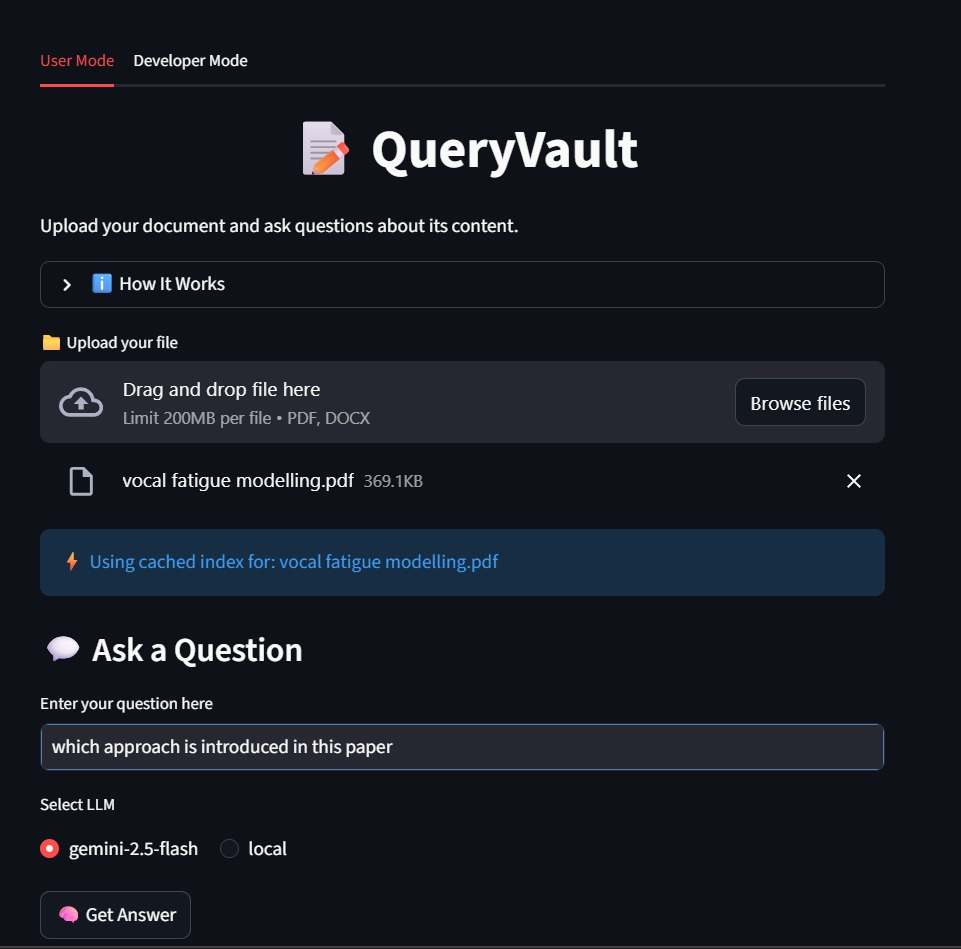

# QueryVault

QueryVault is a production-oriented **RAG-based document question-answering system** built for PDFs and Word documents. It combines local LLM inference, advanced caching, error handling, hallucination monitoring, and a developer dashboard to provide real-time analytics and insights.

QueryVault is designed as a **local-first solution** for developers and AI enthusiasts who want to experiment with multi-agent systems, LLM evaluation, and document-centric AI workflows.

---

## 🚀 Features

- **RAG for PDFs and Word Docs:** Upload documents, extract chunks using multiple fallbacks (`pdfplumber`, `pytesseract`, `pdf2txt`, `python-docx`, `PyPDF2`), and retrieve the most relevant content for user queries.
- **Local LLM Integration:** Uses TinyLlama 1.1B via `llama-server` for offline inference.
- **Error Handling & Logging:** Comprehensive handling for parsing errors, LLM failures, and cache serialization issues.
- **Cache & Performance Optimization:** Stores queries, answers, and top document chunks locally in SQLite3 to reduce latency and improve repeated query performance.
- **Hallucination & Confidence Metrics:** Measures how well the generated answers align with the retrieved context, highlighting possible hallucinations.
- **Developer Dashboard:** Live analytics for latency, hallucinations, token usage, and request logs.

---

## 🖥️ Demo / Screenshots

<!-- Replace with actual screenshots -->

*Developer dashboard showing average metrics and live query logs.*


*User interface for uploading documents and asking questions.*

---

## 📦 Installation

**Requirements:**

- Python 3.10+
- 8GB RAM minimum
- No GPU required for TinyLlama 1.1B (CPU inference only)
- `llama-server` installed for local LLM

**Clone the repository:**

```bash
git clone https://github.com/Khubaib8281/QueryVault.git
cd QueryVault
```

**Install dependencies:**

```bash
pip install -r requirements.txt
```

**Set up local LLM:**

Download the TinyLlama model and start `llama-server`:

```bash
llama-server \
  -m path/to/tinyllama-1.1b-chat-v1.0.Q4_K_M.gguf \
  -c 2048 \
  -t 12
```

**Run QueryVault:**

```bash
streamlit run app/app.py
```

The dashboard and query interface will open in your browser at `http://localhost:8501`.

---

## ⚙️ Usage

1. **Upload Documents:** PDFs or Word `.docx` files.
2. **Ask Questions:** Type your question in the input box.
3. **Select LLM Provider:** Currently, only the local LLM is supported.
4. **Get Answers:** Responses are generated using RAG and displayed immediately.
5. **Metrics:** Developer dashboard shows live latency, hallucination rate, confidence scores, and cached queries.

---

## 🧰 Architecture & Design

**QueryVault** is designed for local, production-style RAG pipelines:

- **Document Processing:** Multi-layer extraction with fallback libraries for OCR and text parsing.
- **Vector Database:** FAISS for embedding-based chunk retrieval.
- **LLM Layer:** TinyLlama 1.1B via llama-server.
- **Caching:** SQLite3 stores queries, answers, top chunks, timestamps, and metrics.
- **Monitoring:** Logs latency, hallucination flags, confidence, and token usage.
- **Dashboard:** Streamlit interface showing real-time analytics.

---

## 🔧 Configuration & Settings

- `MAX_CHUNK_SIZE` – Controls the length of document chunks sent to the model.
- `TEMPERATURE` – Reduce hallucinations by setting to `0.1` for TinyLlama.
- `CACHE_ENABLED` – Enable or disable local query caching.
- `SIMILARITY_THRESHOLD` – Controls whether low-confidence chunks are skipped to avoid hallucinations.

---

## 🛡️ Hallucination Mitigation

- Aggressive chunk trimming based on token limit
- Strict grounding instructions for the model:
  ```
  Answer using ONLY the provided context.
  If the answer is not in the document, reply "NOT FOUND IN DOCUMENT".
  ```
- Low temperature (0.1) and limited max tokens
- Similarity-based gating to prevent answering when context is weak

---

## 📝 Logging & Metrics

QueryVault logs:

- **Query** – User input
- **Answer** – LLM response
- **Top Chunks** – Retrieved document context
- **Latency (ms)** – Time taken for inference
- **Tokens Used** – Tokens consumed for local LLM
- **Confidence** – Cosine similarity-based score
- **Hallucination** – Binary flag (0 or 1)

Logs are persisted in SQLite3 for analysis and benchmarking.

---

## ⚡ Future Enhancements

- Multi-agent workflows for automated document analysis
- Integration of larger local LLMs (7B+) for better grounding and reduced hallucinations
- Optional cloud LLM support for higher accuracy and reliability
- Exportable reports from developer dashboard

---

## 📁 Folder Structure

```
QueryVault/
├─ app/
│  └─ app.py              # Streamlit interface
├─ data/
| ├─ logs.db
├─ core/
│  ├─ confidence.py        
│  ├─ local_llm.py        # TinyLlama integration
│  ├─ cache.py            # SQLite3 caching logic
│  └─ metrics.py          # Latency, hallucination, confidence
│  └─ db.py
│  └─ hallucination.py
│  └─ logger.py
├─ scripts/
│  └─ chunker.py
│  └─ embedder.py
│  └─ vector_store.py
│  └─ gemini_api.py
│  └─ local_llm.py
│  └─ main.py
│  └─ parser.py
│  └─ question_answer.py
├─ assets/
│  ├─ landing.jpeg
│  └─ dashboard.jpeg
├─ requirements.txt
├─ LISENCE
└─ README.md
```

---

## 📚 References & Libraries

- [llama.cpp / llama-server](https://github.com/ggerganov/llama.cpp)
- [FAISS](https://github.com/facebookresearch/faiss)
- [pdfplumber](https://github.com/jsvine/pdfplumber)
- [pytesseract](https://github.com/madmaze/pytesseract)
- [python-docx](https://python-docx.readthedocs.io/)
- [Streamlit](https://streamlit.io/)
- [SQLite3](https://www.sqlite.org/)

---

## 📝 License

MIT License © 2026 Muhammad Khubaib Ahmad

---

### 💡 Notes

QueryVault is **local-first** and designed for experimentation with RAG pipelines, multi-agent workflows, and evaluation metrics. TinyLlama is used as a demo LLM; expect hallucinations with complex queries.  

For reliable results in production, consider larger LLMs or cloud APIs.
```